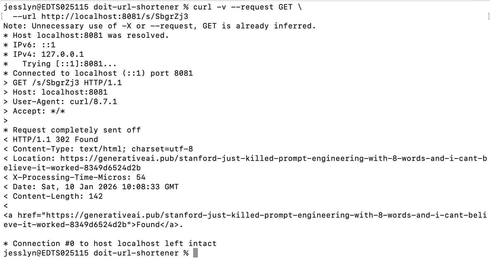
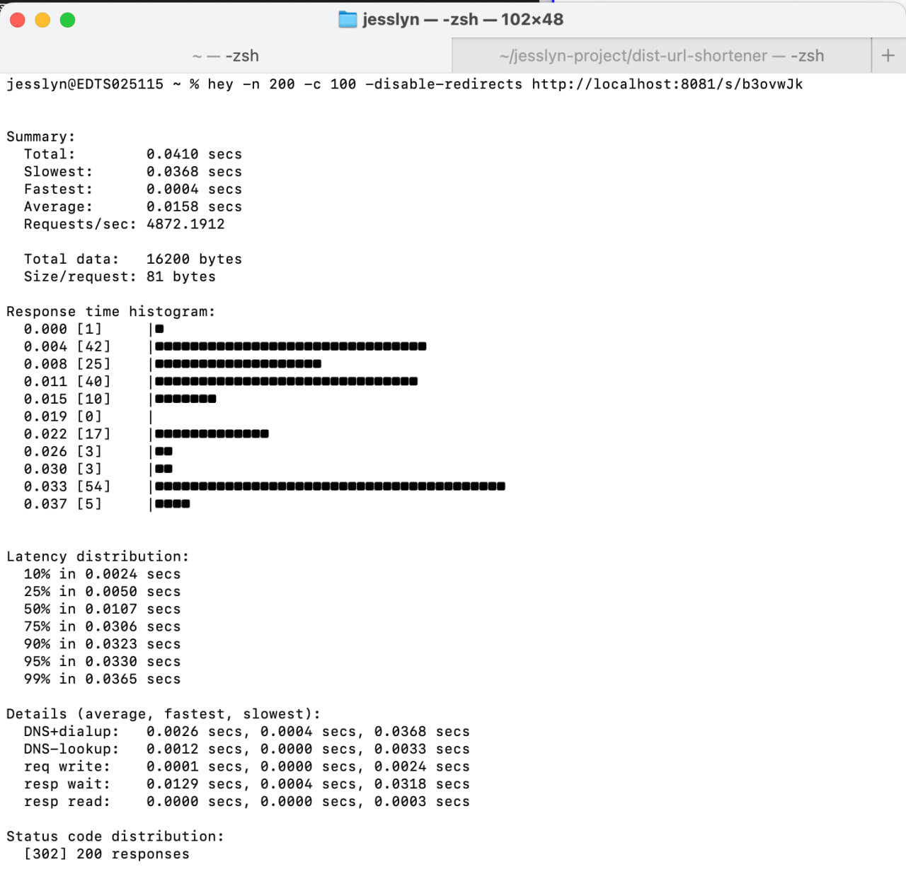

# Distributed URL Shortener

A simple, production-oriented URL shortener service designed with clean architecture, concurrency safety, and cloud scalability in mind.

---

## Table of Contents
- Architecture Overview
- Gap Analysis
- Capacity Planning
- Service Level Management
- Future Enhancements
- Running Locally with Docker
- Testing Philosophy
- Concurrency Validation
- Infrastructure as Code (Terraform)
- Final Notes

---

## 1. Architecture Overview

### Data Model

The core entity of the system is a shortened URL and its associated metadata:

> ShortURL
>- code (string, primary key)
>- long_url (string)
>- created_at (timestamp)
>- expires_at (timestamp)
>- click_count (integer)
>- last_accessed_at (timestamp)

- `code` uniquely identifies the shortened URL.
- `expires_at` enforces TTL-based expiration.
- `click_count` and `last_accessed_at` provide basic analytics.

The application uses a storage abstraction (`Store` interface), allowing the storage engine to be replaced without modifying business logic.

---

### High-Level System Architecture

Client
- HTTP (POST /shorten, GET /s/{code}, GET /stats/{code})
- HTTP Layer (Handlers / Router)
- Domain Service (URL Service)
- Storage Interface (Store)
- In-Memory Store (current)
- Managed Store (future: DynamoDB / Redis)

Design principles:
- Clear separation of concerns using Hexagonal Architecture
- Dependency inversion (domain depends on interfaces)
- Stateless service design for horizontal scalability

---

## 2. Gap Analysis

### Why In-Memory Storage Is Unsuitable for Stateless Cloud Environments

The current in-memory storage is intentionally used for simplicity and testing. However, it is incompatible with a stateless cloud environment (e.g., AWS Lambda or container-based deployments):

1. No Persistence  
   Data is lost on process restarts (cold starts, container restarts).

2. No Horizontal Consistency  
   Each instance maintains isolated memory, leading to inconsistent redirects.

3. No Elastic Scalability  
   Stateless compute requires external storage to scale independently.

---

### How Managed Storage Solves This

A managed datastore such as DynamoDB, Redis, or Firestore provides:

- Durability: Data persists beyond compute lifecycle.
- Consistency: All instances share a single source of truth.
- Scalability: Storage scales independently of compute.
- Operational Simplicity: No manual sharding or failover management.

Because the application uses a `Store` interface, migrating to managed storage requires no changes to domain logic.

---

## 3. Capacity Planning

### Storage Estimation (12 Months)

Assumptions:
- 100 million new URLs per month
- Average record size ≈ 500 bytes

Monthly storage:
100,000,000 × 500 bytes ≈ 50 GB

Annual storage:
50 GB × 12 months = 600 GB

Estimated storage requirement: ~600 GB per year.

---

### Scaling Strategy for 10,000 Requests per Second

The redirect endpoint is:
- Read-heavy
- Key-based (`code`)
- Latency-sensitive

Scaling approach:
1. Stateless compute (Lambda / containers) with automatic horizontal scaling
2. Managed key-value store with O(1) lookups
3. Optional caching layer (e.g., Redis) for hot URLs

This design comfortably supports 10,000+ requests per second.

---

## 4. Service Level Management

### Service Level Indicators (SLIs)

SLI 1: Redirect Availability  
Percentage of successful redirect responses (HTTP 302).

SLI 2: Redirect Latency  
P95 response latency for redirect requests.

---

### Service Level Objectives (SLOs)

- Redirect Availability: 99.9%
- Redirect Latency: P95 < 100ms

---

### On-Call Intervention Scenario

Scenario:  
A sudden traffic spike causes elevated latency and error rates on the redirect endpoint.

Symptoms:
- P95 latency exceeds 100ms
- Increased 5xx errors from the storage layer

Action:
- Investigate datastore throttling or regional degradation
- Mitigate via caching, capacity adjustments, or traffic throttling

This scenario directly impacts user experience and requires on-call intervention.

---

## 5. Future Enhancements

With additional time, the following improvements would be prioritized:
1. Managed Storage Integration  
   Implement DynamoDB or Redis-backed storage.
2. Caching Layer  
   Reduce datastore load for hot URLs.
3. Rate Limiting  
   Protect against abuse and traffic spikes.
4. Observability  
   Metrics, tracing, structured logging, correlation IDs.
5. Advanced TTL Policies  
   Custom expiration rules and background cleanup.
6. Security Enhancements  
   Abuse detection, stricter validation, admin authentication.

---

## Running Locally with Docker

The service can be run locally using Docker to simulate a production-like environment.

### Prerequisites
- Docker installed
- Docker daemon running

### Build the Docker Image

From the project root:

```bash
docker build -t dist-url-shortener .
```

### Run the Container

```bash
docker run \
  --name dist-url-shortener \
  -p 8081:8081 \
  -e APP_NAME=dist-url-shortener \
  -e APP_PORT=8081 \
  -e URL_TTL_SECONDS=86400 \
  dist-url-shortener
```

Explanation:
- --name dist-url-shortener assigns a readable container name
- -p 8081:8081 exposes the HTTP port
- Environment variables configure the application at runtime

### Verify the Service

Health check:
```bash
curl http://localhost:8081/health
```

Create a Short URL:
```bash
curl -X POST http://localhost:8081/shorten \
  -H "Content-Type: application/json" \
  -d '{"long_url":"https://example.com"}'
```

Resolve the short URL:
```bash
curl -v http://localhost:8081/s/{code}
```



Get statistics:
```bash
curl http://localhost:8081/stats/{code}
```

---

## Testing Philosophy

The test suite emphasizes signal over coverage:
- Concurrency validation using 100+ goroutines and the Go race detector
- Deterministic TTL expiration via a mocked clock (no sleeps)
- Domain logic tested against storage interfaces, not concrete implementations

### Test Structure

Domain-level tests use table-driven patterns to validate multiple scenarios (success paths and error cases) in a concise and readable manner, following idiomatic Go testing practices.


---

## Concurrency Validation (Runtime)

Concurrency safety is validated using a unit test that spawns more than 100 goroutines concurrently incrementing the click counter. Shared state is protected using idiomatic Go synchronization primitives, and the test suite is executed with the Go race detector to ensure no data races occur.

To run concurrency tests with race detection:

```bash
go test ./... -race
```

This verifies that the click_count logic remains correct under high-frequency concurrent updates.


In addition to unit tests, the service can be exercised under concurrent HTTP load:
```bash
hey -n 200 -c 100 -disable-redirects http://localhost:8081/s/{code}
```



---

## Infrastructure as Code (Terraform)

The production environment is defined using Terraform to demonstrate how the service would be deployed in a stateless cloud environment.

The Terraform configuration defines:
- Serverless compute using AWS Lambda
- Managed storage using DynamoDB
- IAM roles and policies following the Principle of Least Privilege

This configuration is intentionally focused on infrastructure design rather than full deployment automation. The application currently uses an in-memory storage implementation for simplicity, while the Terraform configuration illustrates how the service would be backed by a managed datastore in production.

The infrastructure definition is syntactically valid and can be initialized and validated using:

```bash
terraform init  
terraform validate
```

In a real deployment, the Lambda artifact and CI/CD pipeline would be responsible for packaging and deploying the application binary.


---

## Final Notes

This project prioritizes correctness, testability, and cloud readiness while maintaining a clean separation of concerns.  
The design intentionally balances simplicity and production realism, while remaining extensible for future growth.
